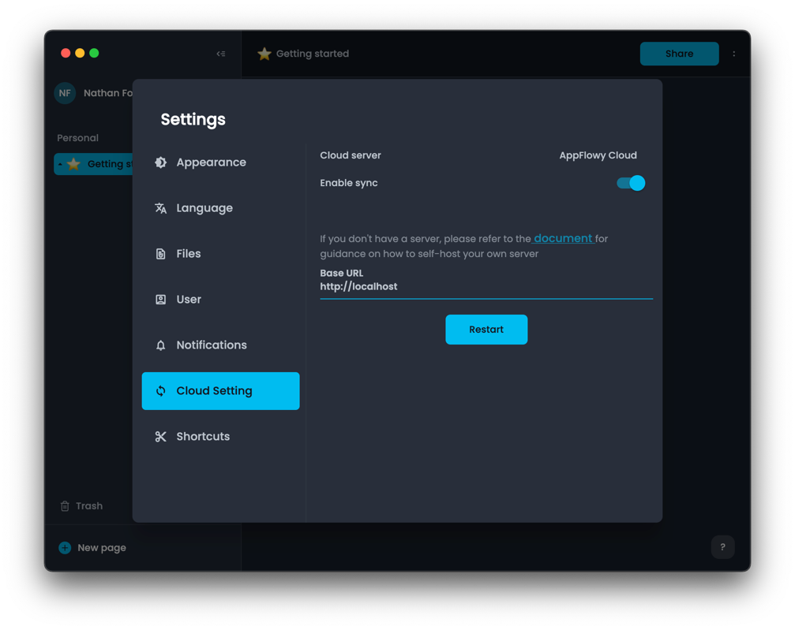
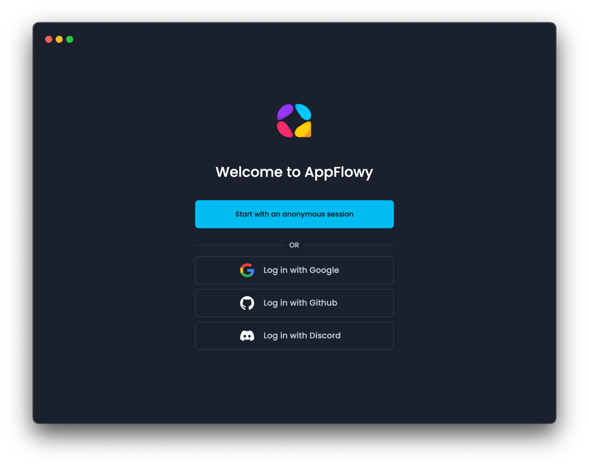
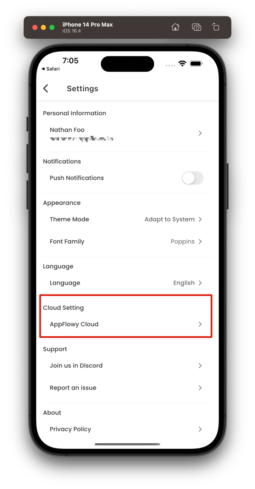
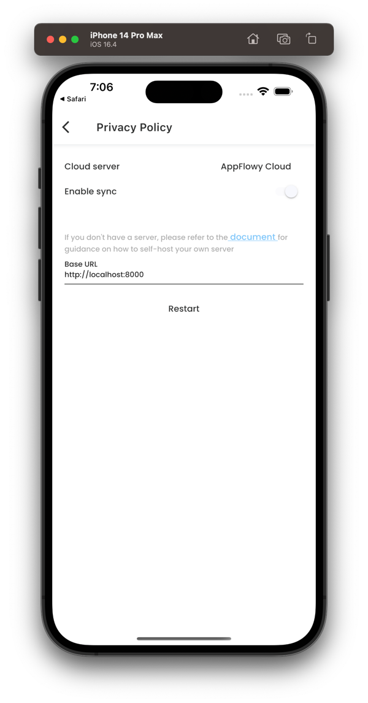

# ☁ Debugging with AppFlowy Cloud

## Localhost
This guide outlines how to debug the AppFlowy application using AppFlowy Cloud. Start by setting up AppFlowy Cloud on your
local machine, as detailed in the [development guide](https://github.com/AppFlowy-IO/AppFlowy-cloud). Once AppFlowy Cloud
is running, build the AppFlowy application from its source code and launch it. Navigate to the settings page in the 
application and choose `AppFlowy Cloud` as your cloud provider. For the server address, enter `http://localhost`. 
Click `Restart` to save your changes and reinitialize the application.

### Desktop

After restarting, you can log in to the application.

### Mobile

After restarting the application, you'll need to log in. To do this, navigate to the `Setting` page and select `Logout`.
This action will redirect you to the login page.

During this process, AppFlowy Cloud will generate logs in the console, allowing you to monitor and debug interactions
between the application and the cloud service. Keep an eye on these logs to troubleshoot any issues or to understand
how the application communicates with AppFlowy Cloud.

## Self-Hosted Server

Please refer to this [Self-Hosting AppFlowy Cloud](../../guides/appflowy/self-hosting-appflowy.md) for more information.