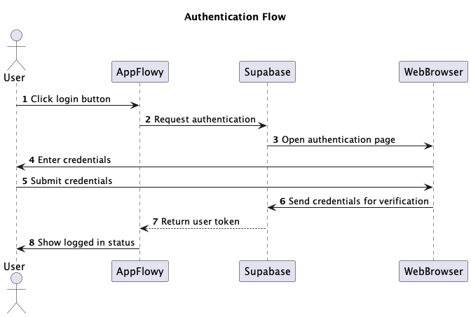
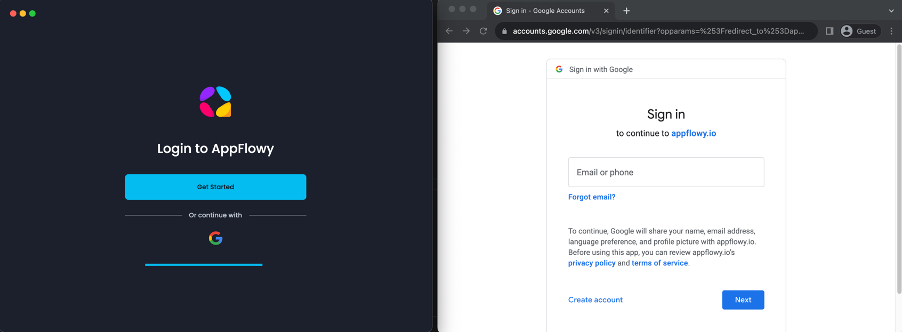
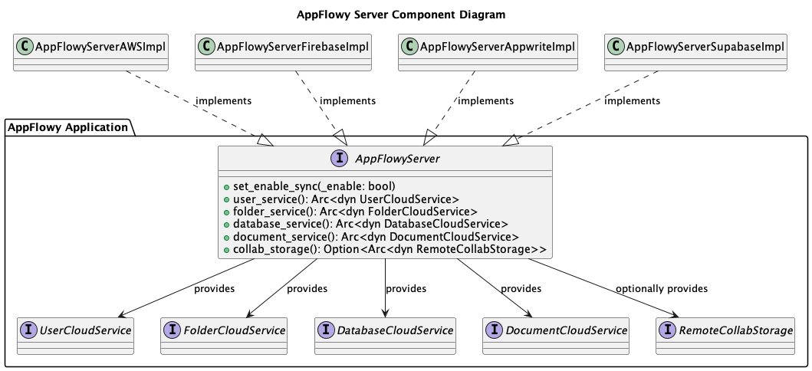
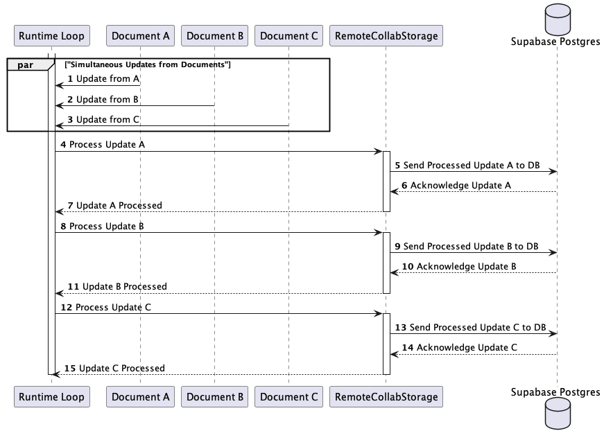

# AppFlowy with Supabase(WIP)
AppFlowy, known for its user-friendly features in local apps, now allows users to upload data to the Cloud. We've chosen Supabase, an open-source alternative to Firebase, to manage user sign-ins and data storage. With a Supabase project, anyone can easily implement a self-hosted AppFlowy.

Let's explore how AppFlowy uses Supabase for these tasks.

# Table of Contents

- [Authentication](#Authentication)
  - [Dive in the code](#Dive in the code)
  - [Deep Links](#Deep Links)
  - [Voila!](#Voila!)
- [Data storage](#Data storage)
  - [Architecture Design](#Architecture Design)
  - [Supabase implementation](#Supabase implementation)
    - [Database schema](#Database schema)
    - [Dive in the code](#Dive in the code)
- [Realtime](#Realtime)

# Authentication

Initially, we considered building our own authentication service from scratch, one that would support social third-party authentication, magic links, and traditional email & password login. However, we soon realized that there were open-source projects available that already offer these features. That led us to the discovery of the Supabase authentication service, which provides multiple methods for user authentication.

- Email & password
- Magic links
- Social providers
- Phone logins

This is exactly what we need. We can leverage Supabase's authentication service to implement AppFlowy's authentication system. After follow the instructions in [this documentation](https://supabase.com/docs/guides/auth), we successfully set up the authentication service. 

## Dive in the code
Additionally, there's a Flutter package named [supabase_flutter](https://pub.dev/packages/supabase_flutter) which can be seamlessly integrated into AppFlowy. It perfectly meets our requirements. We utilize the `env` file to inject the supabase configuration into the app. Consequently, simply adding `supabase_flutter` and `envied` to the `pubspec.yaml` is all that's needed to kickstart the process.

```yaml
dependencies:
  supabase_flutter: ^1.10.4
  envied: ^0.3.0+3
  
dev_dependencies:
  envied_generator: ^0.3.0+3
```

**Configuring the .env File**

Start by creating a file named `.env` in the `appflowy_flutter` directory. Then, establish the `env.dart` file, which defines the global environment variables.

* .env
```dotenv
SUPABASE_URL=https://xxx.supabase.co
SUPABASE_ANON_KEY=xxx
SUPABASE_JWT_SECRET=xxx
```

* env.dart

```dart
@Envied(path: '.env')
abstract class Env {
  @EnviedField(
    obfuscate: true,
    varName: 'SUPABASE_URL',
    defaultValue: '',
  )
  static final String supabaseUrl = _Env.supabaseUrl;
  @EnviedField(
    obfuscate: true,
    varName: 'SUPABASE_ANON_KEY',
    defaultValue: '',
  )
  static final String supabaseAnonKey = _Env.supabaseAnonKey;

  @EnviedField(
    obfuscate: true,
    varName: 'SUPABASE_JWT_SECRET',
    defaultValue: '',
  )
  static final String supabaseJwtSecret = _Env.supabaseJwtSecret;
}
```

Afterwards, run the following command to generate the `env.g.dart` file. This file contains the environment variables we defined in the `.env` file.

```shell
dart run build_runner build --delete-conflicting-outputs
```

**Initialize the supabase**

Before utilizing the Supabase instance, it must be initialized. This initialization takes place in the `supabase_task.dart` file. We define the 
`SupabaseLocalStorage` to customize the storage of the Supabase auth data.

```dart
 await Supabase.initialize(
   url: Env.supabaseUrl,
   anonKey: Env.supabaseAnonKey,
   debug: kDebugMode,
   localStorage: const SupabaseLocalStorage(),
 );
```

**Perform authentication**

Our authentication logic leverages an abstract class named `AuthService`. This class's Supabase implementation can be found in `SupabaseAuthService`, specifically within the `supabase_auth_service.dart` file. 

```dart
 @override
  Future<Either<FlowyError, UserProfilePB>> signUpWithOAuth({
    required String platform,
    AuthTypePB authType = AuthTypePB.Supabase,
    Map<String, String> params = const {},
  }) async {
    final provider = platform.toProvider();
    final completer = supabaseLoginCompleter(
      onSuccess: (userId, userEmail) async {
        return await _setupAuth(
          map: {
            AuthServiceMapKeys.uuid: userId,
            AuthServiceMapKeys.email: userEmail,
            AuthServiceMapKeys.deviceId: await getDeviceId()
          },
        );
      },
    );

    final response = await _auth.signInWithOAuth(
      provider,
      queryParams: queryParamsForProvider(provider),
      redirectTo: supabaseLoginCallback,
    );
    if (!response) {
      completer.complete(left(AuthError.supabaseSignInWithOauthError));
    }
    return completer.future;
  }
```
The authentication flow is shown below:
1. The user clicks the login button in AppFlowy.
2. AppFlowy requests Supabase to start the authentication process.
3. Supabase prompts a web browser to open for authentication.
4. The user enters their credentials in the browser.
5. Once entered, the credentials are sent to Supabase for verification.
6. Supabase verifies the credentials and sends a user token back to AppFlowy.
7. AppFlowy updates to show the user they're logged in.




## Deep Links

## Voila!
Ultimately, by clicking the Google login button, users are directed to a web browser to finalize the authentication process. Once authenticated, they are seamlessly redirected back to AppFlowy. Truly, integrating Supabase authentication into AppFlowy is a straightforward endeavor.



# Data storage
## Architecture Design

One of the prerequisites for AppFlowy Data Storage is supporting multiple cloud services. To realize this, we've architected a modular design that accommodates the integration of diverse cloud services. Each implementation supplies the specific logic for the functions delineated in the AppFlowyServer interface. This architectural design is depicted below:



As you can see, with the `AppFlowyServer` interface, we can seamlessly switch between different cloud services. For instance, transitioning from Supabase to AWS or Firebase is as simple as altering the implementation of the `AppFlowyServer` interface. This flexibility is a notable benefit of its modular design. The `AppFlowyServer` comprises five components, with each component handling a distinct set of functionalities. Let's delve into each of these components.

* UserCloudService

The UserCloudService represents a standardized set of functionalities for interacting with a cloud-based user management service. This includes operations for registering new users, authenticating existing ones, managing user profiles, and handling user workspaces. In addition to basic user management, the interface provides methods for managing collaborative objects, subscribing to user updates, and receiving real-time events.

* DocumentCloudService

The `DocumentCloudService` represents a set of standardized functionalities for managing and retrieving information related to documents in a cloud service. It facilitates fetching updates to a given document, obtaining snapshots of a document up to a specified limit, and accessing the primary data of a document. This interface is designed to offer asynchronous operations to ensure efficient and non-blocking interactions when dealing with document data in a cloud environment.

* DatabaseCloudService

The `DatabaseCloudService` represents a set of standardized operations focused on collaborative objects within a cloud-based database. This interface allows for the retrieval of updates for a specific collaborative object, batch fetching of updates for multiple collaborative objects of a given type, and obtaining a set number of snapshots for a collaborative object. These functionalities ensure efficient and streamlined interactions when managing and accessing collaborative data in a cloud database environment.

* RemoteCollabStorage

The `RemoteCollabStorage` interface provides a suite of operations for managing collaborative objects in a remote storage system. This includes checking whether the remote storage is active and functions for retrieving all updates, snapshots, and the state of a collaborative object. Furthermore, there are methods to create snapshots and dispatch updates or initial states to the remote storage. The service is built with asynchronous operations in mind, as evident by the `async` keyword, ensuring that activities like fetching or sending data don't block other operations. It also allows subscribing to remote updates, giving users the capability to stay updated with changes in the collaborative object.


* FolderCloudService

The `FolderCloudService` interface outlines a set of operations centered around managing workspaces and folders in a cloud environment. It offers capabilities to create a new workspace and fetch data, snapshots, and updates related to a specific folder within a workspace. .

Currently, we only support Supabase as a cloud service provider. However, we intend to support other cloud services in the future. Let's explore how to implement the `AppFlowyServer` using Supabase.

## Supabase implementation
Upon integrating Supabase authentication, we discovered it inherently offers a PostgreSQL database. This advantage implies that individual users self-hosting AppFlowy on Supabase won't require separate data storage setups. Each Supabase project is pre-equipped with a dedicated PostgreSQL database, which we leverage to store AppFlowy's data.

### Database schema

We utilize the Postgres database to store:
1. User profiles
2. User settings
3. Data related to documents and databases generated within AppFlowy
4. Relationships between users and their associated workspaces

Here's what our schema looks like:


1. **`af_roles` table**: Captures roles, e.g., 'Owner', 'Member', 'Guest'.

2. **`af_permissions` table**: Chronicles permissions, each featuring a name, description, and access tier.

3. **`af_role_permissions` table**: A junction table representing permissions assigned to roles.

4. **`af_user` table**: Houses user details, including a unique identifier (uid).

5. **`af_workspace` table**: Lists workspaces, each linked to a user via the user's uid.

6. **`af_workspace_member` table**: Associates members with their workspaces and respective roles.

7. **`af_collab` & `af_collab_member` tables**: Denote collaborations and their constituent members.

8. **Update tables**: (`af_collab_update`, `af_collab_update_document`, etc.): Handle collaboration updates.

9. **Statistics & snapshot tables**: (`af_collab_statistics`, `af_collab_snapshot`, `af_collab_state`): Track collaboration metrics and snapshots.

10. **`af_user_profile_view` view**: Fetches the latest workspace_id for every user.

We've developed a [tool](https://github.com/AppFlowy-IO/AppFlowy-Supabase) designed to set up the database tables, triggers, and functions within a Supabase PostgreSQL database. With this tool, a single command can configure your database. For a detailed guide, please consult [this documentation](https://github.com/AppFlowy-IO/AppFlowy-Supabase/tree/main/postgres).

### Dive in the code

AppFlowy's backend is built using Rust, necessitating a Rust crate to facilitate interaction with the Postgres database. Fortunately, the community has provided [postgrest-rs](https://github.com/supabase-community/postgrest-rs), a crate tailored to implement Supabase's Postgres database functionalities.




We won't delve too deeply here since it's beyond the scope of this article. However, it's worth highlighting the RPC function, which proves invaluable for customizing database actions. We've defined a function named `flush_collab_updates_v3`. This function locks the row with a specified oid, consolidates the updates into one, and subsequently deletes the merged updates.

```rust
pub(crate) async fn flush_collab_with_update(
  object: &CollabObject,
  update_items: Vec<UpdateItem>,
  postgrest: &Arc<Postgres>,
  update: Vec<u8>,
  secret: Option<String>,
) -> Result<(), Error> {
  // 2.Merge the updates into one and then delete the merged updates
  let merge_result = spawn_blocking(move || merge_updates(update_items, update)).await??;
  tracing::trace!("Merged updates count: {}", merge_result.merged_keys.len());

  let workspace_id = object
    .get_workspace_id()
    .ok_or(anyhow::anyhow!("Invalid workspace id"))?;

  let value_size = merge_result.new_update.len() as i32;
  let md5 = md5(&merge_result.new_update);

  let (new_update, encrypt) =
    SupabaseBinaryColumnEncoder::encode(merge_result.new_update, &secret)?;
  let params = InsertParamsBuilder::new()
    .insert("oid", object.object_id.clone())
    .insert("new_value", new_update)
    .insert("encrypt", encrypt)
    .insert("md5", md5)
    .insert("value_size", value_size)
    .insert("partition_key", partition_key(&object.ty))
    .insert("uid", object.uid)
    .insert("workspace_id", workspace_id)
    .insert("removed_keys", merge_result.merged_keys)
    .insert("did", object.get_device_id())
    .build();

  postgrest
    .rpc("flush_collab_updates_v3", params)
    .execute()
    .await?
    .success()
    .await?;
  Ok(())
}

```


